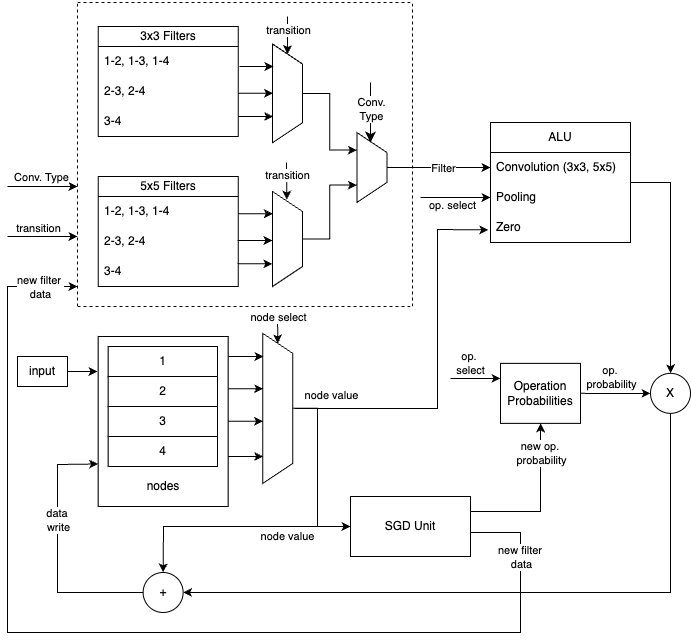

# DARTS Accelerator Research Project
This project explores the possibility of accelerating the training loop of the DARTS neural architecture search algorithm on hardware.
In its current state this project is ongoing at Sabanci University.
Consult the final report for architectural and progress related details.

## Architectural Specifications

